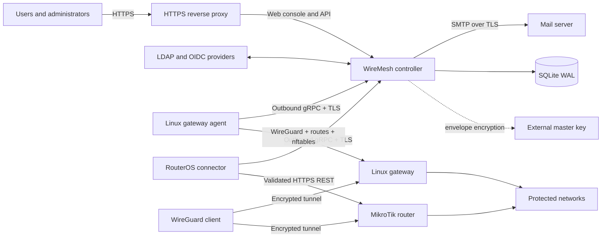

# WireMesh

WireMesh is an open-source, self-hosted WireGuard access controller for people,
devices, and multiple private sites. Connect your identity providers, grant
groups access to sites, and let users create their own browser-held keys and
download one split-tunnel profile.

WireMesh is designed for organizations that want a small, understandable VPN
control plane without placing client private keys in a SaaS service—or even in
the WireMesh database.

> WireMesh is currently an early-stage project. Test Linux and RouterOS
> behavior in your environment before production use.

## Why WireMesh?

- **Private keys stay private.** Device keys are created in the browser. The
  controller receives only the public key; later downloads accept the private
  key locally or produce a `<CLIENT_PRIVATE_KEY>` placeholder.
- **One profile, many sites.** A user's configuration contains one WireGuard
  peer for each authorized site and only the routes that site protects.
- **Identity-aware access.** Local, LDAP, and OIDC identities link through a
  canonical user UUID and normalized email. Groups retain their source
  provenance and drive site grants and firewall policy.
- **Gateway-enforced policy.** Ordered, first-match ACLs are compiled into a
  dedicated nftables table on Linux or managed RouterOS chains on MikroTik.
- **Outbound agents.** Gateway agents initiate the persistent TLS connection,
  making NAT and restrictive edge networks straightforward to operate.
- **Safe lifecycle management.** Addresses and public keys stay quarantined
  until every relevant gateway acknowledges peer removal—even if access was
  revoked while a gateway was offline.
- **Operationally small.** One controller, SQLite in WAL mode, a master-key
  file outside the database, Prometheus metrics, durable SMTP delivery, and
  consistent online backups.

## Main features

### User and device self-service

- Browser-only X25519 key generation and public-key verification
- Complete and placeholder WireGuard profiles
- QR codes generated only in browser memory
- Per-device limits with user overrides
- Configuration revision warnings, semantic diffs, and manual acknowledgement
- Per-site pending, ready, error, and stale gateway state

### Identity and authorization

- Explicit local, LDAP, and OIDC login realms
- Verified-email OIDC linking with trusted-create or link-only modes
- Multiple paged LDAP sources with nested-group expansion
- Source-aware group merging and LDAP-over-OIDC precedence
- Persistent manual disablement and multi-LDAP reactivation semantics
- Administrator lockout protection and one-time recovery bootstrap
- CSV/TSV user import with validation preview

### Networking and gateway control

- Linux WireGuard, explicit client `/32` routes, nftables, and conntrack cleanup
- RouterOS 7.15+ reconciliation through validated HTTPS REST
- One gateway per site with non-overlapping protected-route validation
- Optional client-to-client routing through one selected gateway
- Stateful return traffic and ordered user/group ACLs
- No SNAT: protected LANs route the client pool back through their gateway
- Monotonic desired-state revisions, drift detection, and idempotent repair

### Operations and security

- Transactional IPv4 allocation and acknowledged key/address retirement
- Containing-supernet pool expansion and scheduled hard subnet migration
- Encrypted LDAP, OIDC, SMTP, and RouterOS credentials
- Argon2id local passwords and single-use enrollment/reset tokens
- Append-only control-plane audit history
- SMTP enrollment, reset, access, profile, and migration notifications
- Health, readiness, and Prometheus endpoints
- Multi-architecture GHCR images and static Linux release artifacts

## Deployment architecture



The browser endpoint should sit behind your normal HTTPS reverse proxy. Gateway
agents connect to the controller's separate TLS gRPC endpoint and authenticate
with random 256-bit bearer secrets. Mutual TLS is not required.

The controller never stores client or gateway WireGuard private keys. Its
external master key encrypts identity-provider, SMTP, and RouterOS credentials;
back up that key separately from SQLite.

## Quick start with GHCR

You need a Linux host with Docker Engine, Docker Compose v2, OpenSSL, `curl`,
and a DNS name that resolves to the host from every gateway. The quick start
creates all required secrets without overwriting existing ones:

- a random 256-bit controller master key
- a hostname-valid self-signed TLS certificate for the agent endpoint
- the CA certificate that Linux and MikroTik agents must trust
- a Compose `.env` file with the selected hostname and images
- a persistent SQLite Docker volume
- the first administrator's seven-day enrollment token

### Automated installation

Replace the hostname and administrator email, then run:

```sh
mkdir wiremesh && cd wiremesh

curl -fsSLO https://raw.githubusercontent.com/YiPrograms/WireMesh/main/deploy/compose.quickstart.yml
curl -fsSLO https://raw.githubusercontent.com/YiPrograms/WireMesh/main/deploy/quickstart.sh
chmod +x quickstart.sh

./quickstart.sh vpn.example.org admin@example.org "VPN Administrator"
```

The script pulls `ghcr.io/yiprograms/wiremesh:latest`, generates `secrets/` and
`tls/`, starts the controller, waits for `/readyz`, then prints the one-time
administrator enrollment response. It is safe to rerun: the master key and TLS
key are retained if they already exist.

The console listens on `127.0.0.1:8080` by default and is not exposed to the
network. Port `8443` is the TLS agent endpoint. Complete the HTTPS setup below,
then choose local enrollment and enter the token printed by the script. For a
local evaluation instead, tunnel the console with
`ssh -L 8080:127.0.0.1:8080 user@SERVER-IP` and open
`http://127.0.0.1:8080`.

### Put the web console behind HTTPS

First create a public DNS `A`/`AAAA` record for `vpn.example.org` that points to
the controller host. Allow inbound TCP ports `80`, `443`, and `8443`; port
`8080` does not need to be exposed publicly. On Debian or Ubuntu, install Caddy
and configure the complete reverse proxy with:

```sh
export WIREMESH_HOST=vpn.example.org

sudo apt-get update
sudo apt-get install -y caddy

printf '%s\n' \
  "$WIREMESH_HOST {" \
  '    reverse_proxy 127.0.0.1:8080' \
  '}' | sudo tee /etc/caddy/Caddyfile >/dev/null

sudo caddy validate --config /etc/caddy/Caddyfile
sudo systemctl enable --now caddy
sudo systemctl reload caddy
```

Caddy obtains and renews the browser certificate automatically once DNS and
ports `80`/`443` are reachable. Open `https://vpn.example.org` to enroll the
administrator. The self-signed certificate created by `quickstart.sh` remains
on port `8443` exclusively for gateway agents; copy
`tls/controller-ca.pem` to each gateway as described below.

For an internal-only hostname, use your organization's existing reverse proxy
and private CA instead. The controller remains on `127.0.0.1:8080` behind that
proxy.

Use an immutable release image instead of `latest` by setting it before running
the script:

```sh
export WIREMESH_IMAGE=ghcr.io/yiprograms/wiremesh:1.2.3
./quickstart.sh vpn.example.org admin@example.org "VPN Administrator"
```

Public GHCR packages require no login. For a private package, first run
`docker login ghcr.io` using a token with `read:packages`.

### Manual installation and TLS generation

These are the equivalent commands used by the script. They are useful when
integrating WireMesh into an existing deployment process.

```sh
export WIREMESH_HOST=vpn.example.org
export WIREMESH_IMAGE=ghcr.io/yiprograms/wiremesh:latest

mkdir -p wiremesh/secrets wiremesh/tls
cd wiremesh
chmod 0755 secrets tls

# Download the ready-to-run Compose definition.
curl -fsSLO https://raw.githubusercontent.com/YiPrograms/WireMesh/main/deploy/compose.quickstart.yml

# Generate the controller credential-encryption key.
umask 077
docker run --rm "$WIREMESH_IMAGE" generate-master-key > secrets/master.key

# Generate a self-signed certificate for the agent TLS endpoint.
openssl req -x509 -newkey rsa:3072 -sha256 -nodes -days 825 \
  -keyout tls/controller.key \
  -out tls/controller.crt \
  -subj "/CN=$WIREMESH_HOST" \
  -addext "subjectAltName=DNS:$WIREMESH_HOST" \
  -addext "basicConstraints=critical,CA:TRUE" \
  -addext "keyUsage=critical,digitalSignature,keyEncipherment,keyCertSign" \
  -addext "extendedKeyUsage=serverAuth"

# Agents use this copy as their trust anchor.
cp tls/controller.crt tls/controller-ca.pem

# The controller runs as UID 10001 and needs read access to both private files.
sudo chown 10001:10001 secrets/master.key tls/controller.key
chmod 0400 secrets/master.key tls/controller.key
chmod 0444 tls/controller.crt tls/controller-ca.pem

cat > .env <<EOF
WIREMESH_HOST=$WIREMESH_HOST
WIREMESH_IMAGE=$WIREMESH_IMAGE
WIREMESH_MIKROTIK_IMAGE=ghcr.io/yiprograms/wiremesh-mikrotik-agent:latest
WIREMESH_HTTP_BIND=127.0.0.1
WIREMESH_HTTP_PORT=8080
WIREMESH_AGENT_PORT=8443
EOF
chmod 0600 .env

docker compose -f compose.quickstart.yml pull controller
docker compose -f compose.quickstart.yml up -d controller
curl --fail http://127.0.0.1:8080/readyz

docker compose -f compose.quickstart.yml exec controller \
  wiremesh-controller bootstrap-admin \
  --email admin@example.org \
  --name Administrator
```

Keep `secrets/master.key` backed up separately from the database. Losing it
makes encrypted identity, SMTP, and RouterOS settings unrecoverable. Do not
commit `.env`, `secrets/`, or `tls/controller.key` to source control.

### Connect a Linux gateway

Create an agent in the administration console, or use the CLI:

```sh
docker compose -f compose.quickstart.yml exec controller \
  wiremesh-controller create-agent \
  --name edge-1 \
  --kind linux
```

Copy the returned agent ID and secret immediately; the secret is displayed only
once.

For a Linux gateway, download the static release archive for its architecture,
install `bin/wiremesh-agent-linux` as `/usr/local/sbin/wiremesh-agent-linux`,
and install:

- `deploy/wiremesh-agent-linux.service` as a systemd unit
- `deploy/agent.env.example` as `/etc/wiremesh/agent.env`, with real values

The gateway host must provide `wireguard-tools`, `iproute2`, `nftables`,
`conntrack`, and `sysctl`. Its protected LAN must route the WireMesh client pool
back through the gateway unless the gateway is already its default router.

Copy `tls/controller-ca.pem` from the controller host to
`/etc/wiremesh/controller-ca.pem` on the gateway. Configure
`/etc/wiremesh/agent.env` using the ID and secret returned above:

```dotenv
WIREMESH_CONTROLLER_URL=https://vpn.example.org:8443
WIREMESH_CONTROLLER_SERVER_NAME=vpn.example.org
WIREMESH_CONTROLLER_CA=/etc/wiremesh/controller-ca.pem
WIREMESH_AGENT_ID=00000000-0000-0000-0000-000000000000
WIREMESH_AGENT_SECRET=replace-with-the-one-time-agent-secret
WIREMESH_STATE_DIRECTORY=/var/lib/wiremesh
```

Then enable the supplied systemd service:

```sh
sudo systemctl daemon-reload
sudo systemctl enable --now wiremesh-agent-linux
sudo systemctl status wiremesh-agent-linux
```

### Connect a MikroTik gateway

Create an agent with `--kind mikrotik`, place its returned ID and secret in
`.env`, then start the optional connector profile:

```sh
cat >> .env <<'EOF'
WIREMESH_AGENT_ID=00000000-0000-0000-0000-000000000000
WIREMESH_AGENT_SECRET=replace-with-the-one-time-agent-secret
EOF

docker compose -f compose.quickstart.yml --profile mikrotik up -d mikrotik-agent
docker compose -f compose.quickstart.yml logs -f mikrotik-agent
```

Configure each RouterOS HTTPS origin and credential in the Sites page. The
credential remains encrypted in the controller and is delivered to the
connector in memory over its authenticated TLS stream.

## Operations

### Observability

- `/healthz` — process liveness
- `/readyz` — database readiness
- `/metrics` — Prometheus metrics

The administration dashboard shows address-pool usage, gateway freshness, and
desired/applied revision drift. Offline gateways retain their last working state
and make pending revocation debt visible.

### Backup

Use the controller's online SQLite backup command while the service is running:

```sh
mkdir -p backups
backup_name="wiremesh-$(date -u +%Y%m%dT%H%M%SZ).db"

docker compose -f compose.quickstart.yml exec controller wiremesh-controller \
  --database-url sqlite:///var/lib/wiremesh/wiremesh.db \
  backup --output "/var/lib/wiremesh/$backup_name"

controller_id=$(docker compose -f compose.quickstart.yml ps -q controller)
docker cp "$controller_id:/var/lib/wiremesh/$backup_name" "backups/$backup_name"

# Store this copy separately from the database backup.
sudo install -m 0400 -o root -g root \
  secrets/master.key backups/wiremesh-master.key
```

Move `backups/wiremesh-master.key` to a different protected backup location; do
not leave the only key backup beside the database. A restored database must use
its matching master key. Keep live SQLite and its WAL on a local filesystem;
network filesystems are not supported.

### Subnet changes

A containing-supernet expansion retains existing addresses. Moving to another
subnet uses a scheduled migration: all gateways must first validate and cache
their future state, and the controller will not arm the cutover if any gateway
is unprepared.

## Building and contributing

The workspace uses Rust 1.88 and Node.js 22. With local toolchains:

```sh
cargo test --locked --workspace
cargo clippy --locked --workspace --all-targets -- -D warnings

cd web
npm ci
npm test
npm run build
```

Docker-based development commands are also available:

```sh
docker compose -f compose.dev.yml run --rm rust cargo test --locked --workspace
docker compose -f compose.dev.yml run --rm web npm test
docker compose -f compose.dev.yml run --rm web npm run build
```

Repository layout:

- `crates/controller` — HTTP API, gRPC control plane, SQLite, identity, SMTP,
  auditing, migrations, and background workers
- `crates/domain` — IPAM, route and ACL validation, desired state, and client
  configuration models
- `crates/agent-core` — agent protocol, state cache, reconciliation, and cutover
- `crates/agent-linux` — Linux WireGuard, routes, nftables, and conntrack backend
- `crates/agent-mikrotik` — RouterOS HTTPS REST backend
- `crates/proto` — versioned protobuf contract
- `crates/key-wasm` — browser-side WireGuard key primitives
- `web` — React and TypeScript console
- `deploy` — Dockerfiles, Compose, systemd unit, and environment examples

Pull requests run the Rust and web test suites, build both container images, and
produce x86-64 and ARM64 static artifacts. Pushes to `main` publish `latest` and
SHA-tagged GHCR images. A `v*` tag additionally publishes semantic-version image
tags and attaches binary archives plus SHA-256 checksums to a GitHub Release.

## Security model and limitations

- Client and gateway WireGuard private keys never enter the controller.
- Arbitrary WireGuard directives and shell hooks are not accepted.
- Gateway input policy remains administrator-managed; WireMesh manages only
  forwarded VPN traffic on its dedicated interface and firewall objects.
- WireMesh does not configure SNAT or retain packet and connection logs.
- Agent TLS is server-authenticated and bearer-secret authenticated.
- Audit records exclude passwords, tokens, bearer secrets, and private keys.
- V1 is IPv4 split-tunnel only, with one gateway per site and one active
  SQLite-backed controller.

Please report security issues privately to the repository maintainers rather
than opening a public issue with exploit details.

## License

WireMesh source code is licensed under the
[Apache License 2.0](https://www.apache.org/licenses/LICENSE-2.0).
