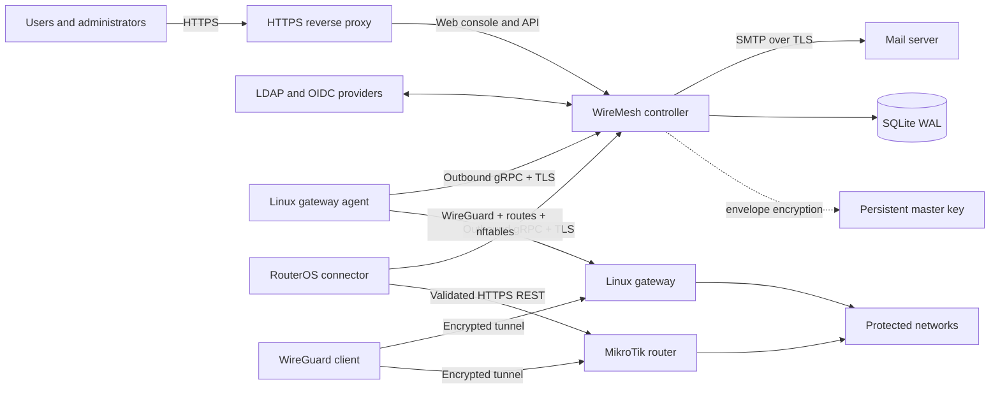

# WireMesh

WireMesh is an open-source, self-hosted WireGuard access controller for people,
devices, and multiple private sites. Connect your identity providers, grant
groups access to sites, and let users create their own browser-held keys and
download one split-tunnel profile.

WireMesh is designed for organizations that want a small, understandable VPN
control plane without placing client private keys in a SaaS service—or even in
the WireMesh database.

> WireMesh is currently an early-stage project. Test Linux and RouterOS
> behavior in your environment before production use.

## Why WireMesh?

- **Private keys stay private.** Device keys are created in the browser. The
  controller receives only the public key; later downloads accept the private
  key locally or produce a `<CLIENT_PRIVATE_KEY>` placeholder.
- **One profile, many sites.** A user's configuration contains one WireGuard
  peer for each authorized site and only the routes that site protects.
- **Identity-aware access.** Local, LDAP, and OIDC identities link through a
  canonical user UUID and normalized email. Groups retain their source
  provenance and drive site grants and firewall policy.
- **Gateway-enforced policy.** Ordered, first-match ACLs are compiled into a
  dedicated nftables table on Linux or managed RouterOS chains on MikroTik.
- **Outbound agents.** Gateway agents initiate the persistent TLS connection,
  making NAT and restrictive edge networks straightforward to operate.
- **Safe lifecycle management.** Addresses and public keys stay quarantined
  until every relevant gateway acknowledges peer removal—even if access was
  revoked while a gateway was offline.
- **Operationally small.** One controller, SQLite in WAL mode, a master-key
  file outside the database, Prometheus metrics, durable SMTP delivery, and
  consistent online backups.

## Main features

### User and device self-service

- Browser-only X25519 key generation and public-key verification
- Complete and placeholder WireGuard profiles
- QR codes generated only in browser memory
- Per-device limits with user overrides
- Configuration revision warnings, semantic diffs, and manual acknowledgement
- Per-site pending, ready, error, and stale gateway state

### Identity and authorization

- Explicit local, LDAP, and OIDC login realms
- Verified-email OIDC linking with trusted-create or link-only modes
- Multiple paged LDAP sources with nested-group expansion
- Source-aware group merging and LDAP-over-OIDC precedence
- Persistent manual disablement and multi-LDAP reactivation semantics
- Administrator lockout protection and one-time recovery bootstrap
- CSV/TSV user import with validation preview

### Networking and gateway control

- Linux WireGuard, explicit client `/32` routes, nftables, and conntrack cleanup
- RouterOS 7.15+ reconciliation through validated HTTPS REST
- One gateway per site with non-overlapping protected-route validation
- Optional client-to-client routing through one selected gateway
- Stateful return traffic and ordered user/group ACLs
- No SNAT: protected LANs route the client pool back through their gateway
- Monotonic desired-state revisions, drift detection, and idempotent repair

### Operations and security

- Transactional IPv4 allocation and acknowledged key/address retirement
- Containing-supernet pool expansion and scheduled hard subnet migration
- Encrypted LDAP, OIDC, SMTP, and RouterOS credentials
- Argon2id local passwords and single-use enrollment/reset tokens
- Append-only control-plane audit history
- SMTP enrollment, reset, access, profile, and migration notifications
- Health, readiness, and Prometheus endpoints
- Multi-architecture controller and gateway-agent images on GHCR, plus static
  Linux release artifacts

## Deployment architecture



The browser endpoint should sit behind your normal HTTPS reverse proxy. Gateway
agents connect to the controller's separate TLS gRPC endpoint and authenticate
with random 256-bit bearer secrets. Mutual TLS is not required.

The controller never stores client or gateway WireGuard private keys. Its
master key encrypts identity-provider, SMTP, and RouterOS credentials. The
container creates that key in its persistent data directory; keep a protected
backup alongside every database backup.

## Quick start with GHCR

You need a Linux host with Docker Engine, Docker Compose v2, and a DNS name that
resolves to the host from every gateway. The controller is the only required
service:

```yaml
services:
  controller:
    image: ghcr.io/yiprograms/wiremesh:latest
    restart: unless-stopped
    init: true
    ports:
      - "127.0.0.1:8080:8080"
      - "8443:8443"
    environment:
      WIREMESH_HOSTNAME: vpn.example.org
      WIREMESH_BOOTSTRAP_ADMIN_EMAIL: admin@example.com
      WIREMESH_BOOTSTRAP_ADMIN_NAME: Administrator
    volumes:
      - ./data/controller:/var/lib/wiremesh
```

On its first startup the container prepares the empty bind-mounted directory
and automatically creates:

- the SQLite database
- a random 256-bit master key
- a self-signed agent TLS certificate and CA for the configured hostname
- the initial administrator and a seven-day, single-use enrollment token

Nothing is regenerated on restart. In particular, an existing administrator's
token is never replaced automatically.

> Upgrading an older deployment that bind-mounts `secrets/master.key` and
> `tls/` remains supported by the image. Keep those mounts until their files
> have been copied into `/var/lib/wiremesh`; never discard the old master key.

### Start the controller

Download the ready-to-run definition, set the two deployment-specific values,
and start it:

```sh
mkdir wiremesh && cd wiremesh
curl -fsSL \
  https://raw.githubusercontent.com/YiPrograms/WireMesh/main/deploy/compose.quickstart.yml \
  -o compose.yml

export WIREMESH_HOSTNAME=vpn.example.org
export WIREMESH_ADMIN_EMAIL=admin@example.org
docker compose up -d
docker compose logs controller
```

Save the enrollment token shown between the `INITIAL WIREMESH ADMINISTRATOR`
lines. Open the web console, choose local enrollment, and use that token to set
the administrator password. If the token is lost, issue another one explicitly:

```sh
docker compose exec controller wiremesh-controller bootstrap-admin \
  --email admin@example.org \
  --name Administrator
```

The console listens on `127.0.0.1:8080` by default. Port `8443` is the gateway
agent TLS endpoint. For a local evaluation, tunnel the console with
`ssh -L 8080:127.0.0.1:8080 user@SERVER-IP` and open
`http://127.0.0.1:8080`.

### Put the web console behind HTTPS

First create a public DNS `A`/`AAAA` record for `vpn.example.org` that points to
the controller host. Allow inbound TCP ports `80`, `443`, and `8443`; port
`8080` does not need to be exposed publicly. On Debian or Ubuntu, install Caddy
and configure the complete reverse proxy with:

```sh
export WIREMESH_HOSTNAME=vpn.example.org

sudo apt-get update
sudo apt-get install -y caddy

printf '%s\n' \
  "$WIREMESH_HOSTNAME {" \
  '    reverse_proxy 127.0.0.1:8080' \
  '}' | sudo tee /etc/caddy/Caddyfile >/dev/null

sudo caddy validate --config /etc/caddy/Caddyfile
sudo systemctl enable --now caddy
sudo systemctl reload caddy
```

Caddy obtains and renews the browser certificate automatically once DNS and
ports `80`/`443` are reachable. Open `https://vpn.example.org` to enroll the
administrator. The automatically generated self-signed certificate remains on
port `8443` exclusively for gateway agents; export its CA from the controller
volume as described below.

For an internal-only hostname, use your organization's existing reverse proxy
and private CA instead. The controller remains on `127.0.0.1:8080` behind that
proxy.

Use an immutable release image instead of `latest` by setting it when starting
or upgrading the deployment:

```sh
export WIREMESH_IMAGE=ghcr.io/yiprograms/wiremesh:1.2.3
docker compose pull
docker compose up -d
```

Public GHCR packages require no login. For a private package, first run
`docker login ghcr.io` using a token with `read:packages`.

### Connect a Linux gateway

Create an agent in the administration console, or use the CLI:

```sh
docker compose exec controller \
  wiremesh-controller create-agent \
  --name edge-1 \
  --kind linux
```

Copy the returned agent ID and secret immediately; the secret is displayed only
once.

The Linux agent is available as a container with all required user-space tools.
It uses the host network namespace and privileged mode so that WireGuard,
routes, forwarding, nftables, and conntrack changes apply to the gateway host.
The host needs Docker Compose and a WireGuard-capable Linux kernel.

On the controller host, export the automatically generated agent CA and copy it
to the gateway:

```sh
docker compose cp \
  controller:/var/lib/wiremesh/tls/controller-ca.pem \
  ./controller-ca.pem
scp ./controller-ca.pem gateway:/tmp/controller-ca.pem
```

On the gateway host, download the agent Compose file and create its environment
file using the one-time credentials returned above:

```sh
sudo mkdir -p /opt/wiremesh
cd /opt/wiremesh
sudo mkdir -p config data/linux-agent
sudo install -m 0600 /tmp/controller-ca.pem ./config/controller-ca.pem
sudo curl -fsSL \
  https://raw.githubusercontent.com/YiPrograms/WireMesh/main/deploy/compose.linux-agent.yml \
  -o compose.yml

sudo tee .env >/dev/null <<'EOF'
WIREMESH_CONTROLLER_URL=https://vpn.example.org:8443
WIREMESH_CONTROLLER_SERVER_NAME=vpn.example.org
WIREMESH_AGENT_ID=00000000-0000-0000-0000-000000000000
WIREMESH_AGENT_SECRET=replace-with-the-one-time-agent-secret
EOF
sudo chmod 0600 .env config/controller-ca.pem

sudo docker compose up -d
sudo docker compose logs -f linux-agent
```

The agent initializes the empty `data/linux-agent` bind directory on first
startup. That directory preserves the gateway's WireGuard private key and
cached desired state across container replacements. Startup fails with a clear
error if `config/controller-ca.pem` was not copied, instead of letting Docker
silently substitute an empty directory. The gateway's protected LAN must route
the WireMesh client pool back through this host unless it is already the LAN's
default router; WireMesh does not add SNAT.

This container has unrestricted control over host networking. Only run a
trusted WireMesh image, pin a release tag for production, and limit access to
the Docker daemon and `/opt/wiremesh/.env`.

To run without Docker, download the static release archive for the gateway's
architecture, install `bin/wiremesh-agent-linux` as
`/usr/local/sbin/wiremesh-agent-linux`, and install
`deploy/wiremesh-agent-linux.service` plus `deploy/agent.env.example`. The host
must then provide `wireguard-tools`, `iproute2`, `nftables`, `conntrack`, and
`sysctl`. After configuring `/etc/wiremesh/agent.env`, enable the service:

```sh
sudo systemctl daemon-reload
sudo systemctl enable --now wiremesh-agent-linux
sudo systemctl status wiremesh-agent-linux
```

### Connect a MikroTik gateway

The controller Compose file deliberately contains no MikroTik service. If a
MikroTik gateway is needed, create its agent credentials:

```sh
docker compose exec controller wiremesh-controller create-agent \
  --name router-1 \
  --kind mikrotik
```

Add `compose.mikrotik.yml` beside `compose.yml`:

```yaml
services:
  mikrotik-agent:
    image: ghcr.io/yiprograms/wiremesh-mikrotik-agent:latest
    restart: unless-stopped
    init: true
    environment:
      WIREMESH_CONTROLLER_URL: https://controller:8443
      WIREMESH_CONTROLLER_SERVER_NAME: vpn.example.org
      WIREMESH_CONTROLLER_CA: /controller-data/tls/controller-ca.pem
      WIREMESH_AGENT_ID: 00000000-0000-0000-0000-000000000000
      WIREMESH_AGENT_SECRET: replace-with-the-one-time-agent-secret
      WIREMESH_STATE_DIRECTORY: /var/lib/wiremesh
    volumes:
      - ./data/controller:/controller-data:ro
      - ./data/mikrotik-agent:/var/lib/wiremesh
```

Alternatively, download that overlay and provide the returned credentials as
environment variables:

```sh
curl -fsSL \
  https://raw.githubusercontent.com/YiPrograms/WireMesh/main/deploy/compose.mikrotik.yml \
  -o compose.mikrotik.yml

export WIREMESH_AGENT_ID=00000000-0000-0000-0000-000000000000
export WIREMESH_AGENT_SECRET=replace-with-the-one-time-agent-secret
docker compose -f compose.yml -f compose.mikrotik.yml up -d mikrotik-agent
docker compose -f compose.yml -f compose.mikrotik.yml logs -f mikrotik-agent
```

The connector entrypoint prepares an empty `data/mikrotik-agent` bind directory
before dropping privileges. It also refuses to start if the controller CA is
missing or empty.

Configure each RouterOS HTTPS origin and credential in the Sites page. The
credential remains encrypted in the controller and is delivered to the
connector in memory over its authenticated TLS stream.

## Operations

### Observability

- `/healthz` — process liveness
- `/readyz` — database readiness
- `/metrics` — Prometheus metrics

The administration dashboard shows address-pool usage, gateway freshness, and
desired/applied revision drift. Offline gateways retain their last working state
and make pending revocation debt visible.

### Backup

Use the controller's online SQLite backup command while the service is running:

```sh
mkdir -p backups
backup_name="wiremesh-$(date -u +%Y%m%dT%H%M%SZ).db"

docker compose exec controller wiremesh-controller \
  --database-url sqlite:///var/lib/wiremesh/wiremesh.db \
  backup --output "/var/lib/wiremesh/$backup_name"

controller_id=$(docker compose ps -q controller)
docker cp "$controller_id:/var/lib/wiremesh/$backup_name" "backups/$backup_name"

# Export the matching encryption key, then protect it from other users.
docker cp "$controller_id:/var/lib/wiremesh/master.key" \
  backups/wiremesh-master.key
chmod 0400 backups/wiremesh-master.key

# Keep the agent CA and key so gateways continue trusting a restored controller.
docker cp "$controller_id:/var/lib/wiremesh/tls" backups/tls
```

Store the database, master key, and TLS directory in a protected backup
location. A restored database must use its matching master key, and restoring
the same agent CA avoids reinstalling trust on every gateway. Keep live SQLite
and its WAL on a local filesystem; network filesystems are not supported.

### Subnet changes

A containing-supernet expansion retains existing addresses. Moving to another
subnet uses a scheduled migration: all gateways must first validate and cache
their future state, and the controller will not arm the cutover if any gateway
is unprepared.

## Building and contributing

The workspace uses Rust 1.88 and Node.js 22. With local toolchains:

```sh
cargo test --locked --workspace
cargo clippy --locked --workspace --all-targets -- -D warnings

cd web
npm ci
npm test
npm run build
```

Docker-based development commands are also available:

```sh
docker compose -f compose.dev.yml run --rm rust cargo test --locked --workspace
docker compose -f compose.dev.yml run --rm web npm test
docker compose -f compose.dev.yml run --rm web npm run build
```

Repository layout:

- `crates/controller` — HTTP API, gRPC control plane, SQLite, identity, SMTP,
  auditing, migrations, and background workers
- `crates/domain` — IPAM, route and ACL validation, desired state, and client
  configuration models
- `crates/agent-core` — agent protocol, state cache, reconciliation, and cutover
- `crates/agent-linux` — Linux WireGuard, routes, nftables, and conntrack backend
- `crates/agent-mikrotik` — RouterOS HTTPS REST backend
- `crates/proto` — versioned protobuf contract
- `crates/key-wasm` — browser-side WireGuard key primitives
- `web` — React and TypeScript console
- `deploy` — Dockerfiles, Compose, systemd unit, and environment examples

Pull requests run the Rust and web test suites, build the controller and both
gateway-agent container images, and produce x86-64 and ARM64 static artifacts.
Pushes to `main` publish `latest` and SHA-tagged GHCR images. A `v*` tag
additionally publishes semantic-version image tags and attaches binary archives
plus SHA-256 checksums to a GitHub Release.

## Security model and limitations

- Client and gateway WireGuard private keys never enter the controller.
- Arbitrary WireGuard directives and shell hooks are not accepted.
- Gateway input policy remains administrator-managed; WireMesh manages only
  forwarded VPN traffic on its dedicated interface and firewall objects.
- WireMesh does not configure SNAT or retain packet and connection logs.
- Agent TLS is server-authenticated and bearer-secret authenticated.
- Audit records exclude passwords, tokens, bearer secrets, and private keys.
- V1 is IPv4 split-tunnel only, with one gateway per site and one active
  SQLite-backed controller.

Please report security issues privately to the repository maintainers rather
than opening a public issue with exploit details.

## License

WireMesh source code is licensed under the
[Apache License 2.0](https://www.apache.org/licenses/LICENSE-2.0).
