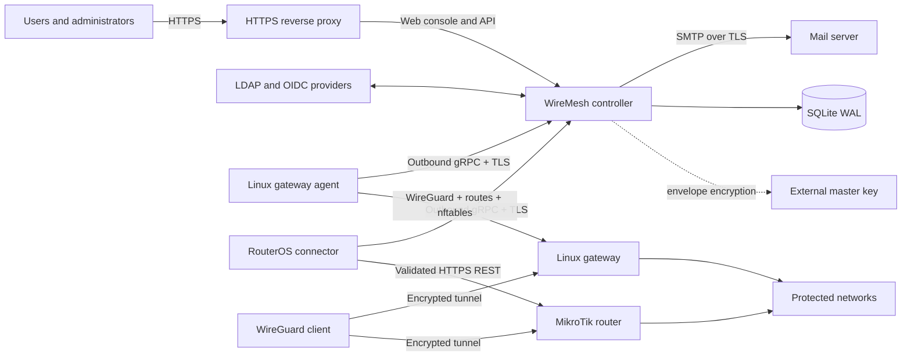

# WireMesh

WireMesh is an open-source, self-hosted WireGuard access controller for people,
devices, and multiple private sites. Connect your identity providers, grant
groups access to sites, and let users create their own browser-held keys and
download one split-tunnel profile.

WireMesh is designed for organizations that want a small, understandable VPN
control plane without placing client private keys in a SaaS service—or even in
the WireMesh database.

> WireMesh is currently an early-stage project. Test Linux and RouterOS
> behavior in your environment before production use.

## Why WireMesh?

- **Private keys stay private.** Device keys are created in the browser. The
  controller receives only the public key; later downloads accept the private
  key locally or produce a `<CLIENT_PRIVATE_KEY>` placeholder.
- **One profile, many sites.** A user's configuration contains one WireGuard
  peer for each authorized site and only the routes that site protects.
- **Identity-aware access.** Local, LDAP, and OIDC identities link through a
  canonical user UUID and normalized email. Groups retain their source
  provenance and drive site grants and firewall policy.
- **Gateway-enforced policy.** Ordered, first-match ACLs are compiled into a
  dedicated nftables table on Linux or managed RouterOS chains on MikroTik.
- **Outbound agents.** Gateway agents initiate the persistent TLS connection,
  making NAT and restrictive edge networks straightforward to operate.
- **Safe lifecycle management.** Addresses and public keys stay quarantined
  until every relevant gateway acknowledges peer removal—even if access was
  revoked while a gateway was offline.
- **Operationally small.** One controller, SQLite in WAL mode, a master-key
  file outside the database, Prometheus metrics, durable SMTP delivery, and
  consistent online backups.

## Main features

### User and device self-service

- Browser-only X25519 key generation and public-key verification
- Complete and placeholder WireGuard profiles
- QR codes generated only in browser memory
- Per-device limits with user overrides
- Configuration revision warnings, semantic diffs, and manual acknowledgement
- Per-site pending, ready, error, and stale gateway state

### Identity and authorization

- Explicit local, LDAP, and OIDC login realms
- Verified-email OIDC linking with trusted-create or link-only modes
- Multiple paged LDAP sources with nested-group expansion
- Source-aware group merging and LDAP-over-OIDC precedence
- Persistent manual disablement and multi-LDAP reactivation semantics
- Administrator lockout protection and one-time recovery bootstrap
- CSV/TSV user import with validation preview

### Networking and gateway control

- Linux WireGuard, explicit client `/32` routes, nftables, and conntrack cleanup
- RouterOS 7.15+ reconciliation through validated HTTPS REST
- One gateway per site with non-overlapping protected-route validation
- Optional client-to-client routing through one selected gateway
- Stateful return traffic and ordered user/group ACLs
- No SNAT: protected LANs route the client pool back through their gateway
- Monotonic desired-state revisions, drift detection, and idempotent repair

### Operations and security

- Transactional IPv4 allocation and acknowledged key/address retirement
- Containing-supernet pool expansion and scheduled hard subnet migration
- Encrypted LDAP, OIDC, SMTP, and RouterOS credentials
- Argon2id local passwords and single-use enrollment/reset tokens
- Append-only control-plane audit history
- SMTP enrollment, reset, access, profile, and migration notifications
- Health, readiness, and Prometheus endpoints
- Multi-architecture GHCR images and static Linux release artifacts

## Deployment architecture



The browser endpoint should sit behind your normal HTTPS reverse proxy. Gateway
agents connect to the controller's separate TLS gRPC endpoint and authenticate
with random 256-bit bearer secrets. Mutual TLS is not required.

The controller never stores client or gateway WireGuard private keys. Its
external master key encrypts identity-provider, SMTP, and RouterOS credentials;
back up that key separately from SQLite.

## Quick start with GHCR

### 1. Prerequisites

You need Docker Engine with Compose, a DNS name reachable by gateway agents,
and a TLS certificate for that name. The example exposes:

- `8080/tcp` for the web/API endpoint, normally behind an HTTPS reverse proxy
- `8443/tcp` for agent gRPC over TLS

GitHub Actions publishes these multi-architecture images:

- `ghcr.io/yiprograms/wiremesh` — controller and web console
- `ghcr.io/yiprograms/wiremesh-mikrotik-agent` — optional RouterOS connector

Use a release tag such as `1.2.3` for stable deployments; `latest` follows the
default branch.

### 2. Create `compose.yml`

```yaml
services:
  controller:
    image: ${WIREMESH_IMAGE:?Set WIREMESH_IMAGE to the controller GHCR image}
    restart: unless-stopped
    ports:
      - "8080:8080"
      - "8443:8443"
    environment:
      WIREMESH_AGENT_TLS_CERT: /run/tls/controller.crt
      WIREMESH_AGENT_TLS_KEY: /run/tls/controller.key
      RUST_LOG: wiremesh_controller=info,tower_http=info
    volumes:
      - wiremesh-data:/var/lib/wiremesh
      - ./secrets/master.key:/run/secrets/wiremesh_master_key:ro
      - ./tls:/run/tls:ro
    healthcheck:
      test:
        - CMD
        - /usr/local/bin/wiremesh-controller
        - --database-url
        - sqlite:///var/lib/wiremesh/wiremesh.db
        - migrate
      interval: 30s
      timeout: 5s
      retries: 3
      start_period: 10s

  mikrotik-agent:
    image: ${WIREMESH_MIKROTIK_IMAGE:-ghcr.io/yiprograms/wiremesh-mikrotik-agent:latest}
    profiles: [mikrotik]
    restart: unless-stopped
    environment:
      WIREMESH_CONTROLLER_URL: https://controller.example.org:8443
      WIREMESH_CONTROLLER_SERVER_NAME: controller.example.org
      WIREMESH_CONTROLLER_CA: /run/controller-ca/controller-ca.pem
      WIREMESH_AGENT_ID: ${WIREMESH_AGENT_ID}
      WIREMESH_AGENT_SECRET: ${WIREMESH_AGENT_SECRET}
      WIREMESH_STATE_DIRECTORY: /var/lib/wiremesh
    volumes:
      - mikrotik-agent-data:/var/lib/wiremesh
      - ./tls/controller-ca.pem:/run/controller-ca/controller-ca.pem:ro

volumes:
  wiremesh-data:
  mikrotik-agent-data:
```

The MikroTik service is behind a Compose profile and is not started unless you
explicitly enable it.

### 3. Create secrets and start WireMesh

Place your agent-endpoint certificate and key at `tls/controller.crt` and
`tls/controller.key`. Put the CA certificate that agents should trust at
`tls/controller-ca.pem`.

```sh
export WIREMESH_IMAGE=ghcr.io/yiprograms/wiremesh:1.2.3

mkdir -p secrets tls
docker run --rm "$WIREMESH_IMAGE" generate-master-key > secrets/master.key
chmod 0400 secrets/master.key tls/controller.key
chmod 0444 tls/controller.crt tls/controller-ca.pem
sudo chown 10001:10001 secrets/master.key tls/controller.key

docker compose pull controller
docker compose up -d controller
docker compose ps
```

Public GHCR packages require no registry login. For a private package, first run
`docker login ghcr.io` with a token containing `read:packages`.

### 4. Bootstrap the administrator

The command prints a seven-day, single-use enrollment token. Open the web
console, select local enrollment, and use that token to set the first password.

```sh
docker compose exec controller wiremesh-controller bootstrap-admin \
  --email admin@example.org \
  --name Administrator
```

Visit `http://localhost:8080` for a local evaluation, or the HTTPS hostname
configured in your reverse proxy.

### 5. Connect a gateway

Create an agent in the administration console, or use the CLI:

```sh
docker compose exec controller wiremesh-controller create-agent \
  --name edge-1 \
  --kind linux
```

Copy the returned agent ID and secret immediately; the secret is displayed only
once.

For a Linux gateway, download the static release archive for its architecture,
install `bin/wiremesh-agent-linux` as `/usr/local/sbin/wiremesh-agent-linux`,
and install:

- `deploy/wiremesh-agent-linux.service` as a systemd unit
- `deploy/agent.env.example` as `/etc/wiremesh/agent.env`, with real values

The gateway host must provide `wireguard-tools`, `iproute2`, `nftables`,
`conntrack`, and `sysctl`. Its protected LAN must route the WireMesh client pool
back through the gateway unless the gateway is already its default router.

For MikroTik, create an agent with `--kind mikrotik`, export its ID and secret,
then start the optional connector:

```sh
export WIREMESH_AGENT_ID=00000000-0000-0000-0000-000000000000
export WIREMESH_AGENT_SECRET=replace-with-the-one-time-secret
export WIREMESH_MIKROTIK_IMAGE=ghcr.io/yiprograms/wiremesh-mikrotik-agent:1.2.3
docker compose --profile mikrotik up -d mikrotik-agent
```

Configure each RouterOS HTTPS origin and credential in the Sites page. The
credential remains encrypted in the controller and is delivered to the
connector in memory over its authenticated TLS stream.

## Operations

### Observability

- `/healthz` — process liveness
- `/readyz` — database readiness
- `/metrics` — Prometheus metrics

The administration dashboard shows address-pool usage, gateway freshness, and
desired/applied revision drift. Offline gateways retain their last working state
and make pending revocation debt visible.

### Backup

Use the controller's online SQLite backup command while the service is running:

```sh
docker compose exec controller wiremesh-controller \
  --database-url sqlite:///var/lib/wiremesh/wiremesh.db \
  backup --output /var/lib/wiremesh/wiremesh-backup.db
```

Copy the resulting database out of the volume and back it up separately from
`secrets/master.key`. A restored database must use its matching master key.
Keep SQLite and its WAL on a local filesystem; network filesystems are not
supported.

### Subnet changes

A containing-supernet expansion retains existing addresses. Moving to another
subnet uses a scheduled migration: all gateways must first validate and cache
their future state, and the controller will not arm the cutover if any gateway
is unprepared.

## Building and contributing

The workspace uses Rust 1.88 and Node.js 22. With local toolchains:

```sh
cargo test --locked --workspace
cargo clippy --locked --workspace --all-targets -- -D warnings

cd web
npm ci
npm test
npm run build
```

Docker-based development commands are also available:

```sh
docker compose -f compose.dev.yml run --rm rust cargo test --locked --workspace
docker compose -f compose.dev.yml run --rm web npm test
docker compose -f compose.dev.yml run --rm web npm run build
```

Repository layout:

- `crates/controller` — HTTP API, gRPC control plane, SQLite, identity, SMTP,
  auditing, migrations, and background workers
- `crates/domain` — IPAM, route and ACL validation, desired state, and client
  configuration models
- `crates/agent-core` — agent protocol, state cache, reconciliation, and cutover
- `crates/agent-linux` — Linux WireGuard, routes, nftables, and conntrack backend
- `crates/agent-mikrotik` — RouterOS HTTPS REST backend
- `crates/proto` — versioned protobuf contract
- `crates/key-wasm` — browser-side WireGuard key primitives
- `web` — React and TypeScript console
- `deploy` — Dockerfiles, Compose, systemd unit, and environment examples

Pull requests run the Rust and web test suites, build both container images, and
produce x86-64 and ARM64 static artifacts. Pushes to `main` publish `latest` and
SHA-tagged GHCR images. A `v*` tag additionally publishes semantic-version image
tags and attaches binary archives plus SHA-256 checksums to a GitHub Release.

## Security model and limitations

- Client and gateway WireGuard private keys never enter the controller.
- Arbitrary WireGuard directives and shell hooks are not accepted.
- Gateway input policy remains administrator-managed; WireMesh manages only
  forwarded VPN traffic on its dedicated interface and firewall objects.
- WireMesh does not configure SNAT or retain packet and connection logs.
- Agent TLS is server-authenticated and bearer-secret authenticated.
- Audit records exclude passwords, tokens, bearer secrets, and private keys.
- V1 is IPv4 split-tunnel only, with one gateway per site and one active
  SQLite-backed controller.

Please report security issues privately to the repository maintainers rather
than opening a public issue with exploit details.

## License

WireMesh source code is licensed under the
[Apache License 2.0](https://www.apache.org/licenses/LICENSE-2.0).
